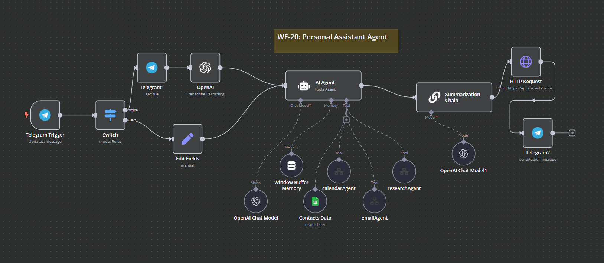
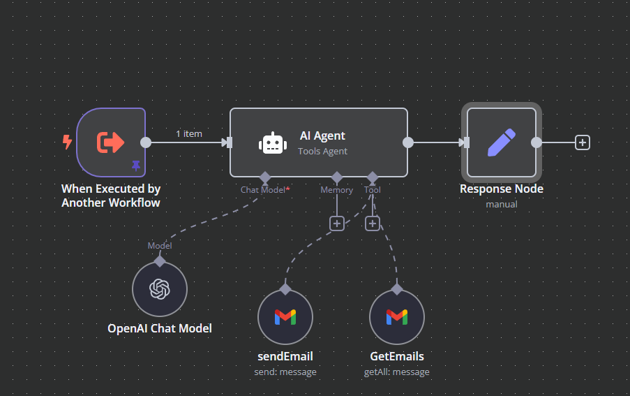

# WF-20: Personal Assistant – n8n Workflow

## 📌 Overview
This **n8n workflow**, `WF-20: Personal Assistant`, is designed to manage emails, schedule events, and conduct research. It integrates multiple sub-workflows for enhanced functionality.

## 🔧 Workflow Components
### 🏗️ Core Modules
1. **📩 WF-20.1: Email Agent** – Handles email-related tasks, including drafting and sending emails.
2. **📅 WF-20.2: Calendar Agent** – Manages scheduling and retrieves event information.
3. **🔎 WF-20.3: Research Agent** – Conducts online research using Wikipedia, Hacker News, and SerpAPI.

## ⚙️ How It Works
1. **WF-20** routes tasks to appropriate sub-workflows:
   - **Email requests** trigger **WF-20.1**.
   - **Calendar scheduling** triggers **WF-20.2**.
   - **Research queries** trigger **WF-20.3**.
2. Each sub-workflow processes the request and returns structured responses.

---

## 📌 WF-20.1: Email Agent
### 🔧 Workflow Components
- **📨 Gmail Integration** – Drafts and sends emails based on user input.
- **✍️ AI-Powered Drafting** – Uses GPT-4o-mini for professional email composition.

### ⚙️ How It Works
1. The workflow captures the recipient, subject, and content.
2. The **AI Agent** generates a refined email.
3. The email is sent via **Gmail API**.

---

## 📌 WF-20.2: Calendar Agent
### 🔧 Workflow Components
- **📅 Google Calendar Integration** – Creates and retrieves events.
- **🤖 AI Scheduling** – Uses AI to interpret scheduling requests.

### ⚙️ How It Works
1. The agent processes calendar-related requests.
2. Events are created or retrieved from **Google Calendar**.
3. The AI refines the schedule and updates the user.

---

## 📌 WF-20.3: Research Agent
### 🔧 Workflow Components
- **📖 Wikipedia** – Fetches information from Wikipedia.
- **📰 Hacker News API** – Searches relevant articles.
- **🔍 SerpAPI** – Conducts Google searches.

### ⚙️ How It Works
1. The user submits a research query.
2. The AI determines the best research source.
3. The result is compiled and presented to the user.

## 📷 Workflow Screenshot

## 🚀 Setup Instructions
- 📥 **Import the workflow** into `n8n`.
- 🔑 **Ensure API credentials** for OpenAI, Gmail, Google Calendar, and research APIs are configured.
- ✅ **Activate the workflow** to enable personal assistant capabilities.

## 📝 Notes
- ⚠️ The workflow is **inactive by default**.
- 🛠️ Customize settings and API keys for optimal performance.
